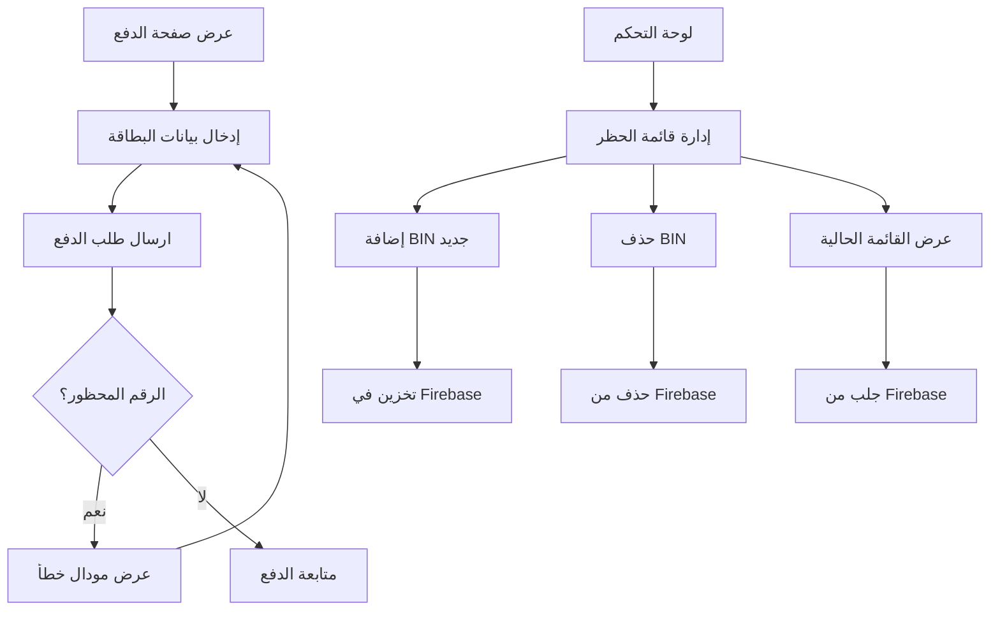

# خطة تنفيذ نظام حظر البطاقات الائتمانية

## نظرة عامة
نظام حظر البطاقات الائتمانية الذي يسمح لأدمن بتحديد فئات البطاقات التي يجب حظرها بناءً على أربع أو ست أول أرقام (BIN) من رقم البطاقة.

## المكونات الرئيسية

### 1. نظام إدارة الحظر
- **المخزن**: استخدام Firebase Realtime Database لتخزين قائمة البطاقات المحظورة
- **الواجهة**: إضافة قسم جديد في لوحة التحكم (Dashboard) لادارة قائمة الحظر
- **العمليات**: إضافة BINs جديد، حذف، عرض، وتصفية

### 2. تحقق البطاقات
- **الدالة**: دالة في `shared/utils.ts` للتحقق من تطابق البطاقة مع قائمة الحظر
- **المعالجة**: تطابق أول 4 أو 6 أرقام من رقم البطاقة مع القائمة المحفوظة
- **الأحذية**: تطابق أفضل matches (6 أرقام أولًا ثم 4)

### 3. واجهة المستخدم
- **مودال خطأ جميل**: مودال يظهر عند محاولة استخدام بطاقة محظورة
- **رسالة خطأ رسمية**: منشئة باللغة العربية
- **تصميم**: متطابق مع تصميم الموقع الحالي (مستخدم Tailwind CSS)

## مخطط العملية


## التحديثات الفعلية

### 1. shared/types.ts
```typescript
export interface BlockedBIN {
  id: string;
  bin: string;
  description: string;
  createdAt: number;
  updatedAt: number;
}

export interface AppConfig {
  blockedBINs: BlockedBIN[];
}
```

### 2. services/server.ts
```typescript
class AdminAPI extends BaseService {
  // ...
  addBlockedBIN(bin: string, description: string) {
    if (!db) return;
    const blockedBinsRef = ref(db, 'blockedBins');
    const newBinRef = push(blockedBinsRef);
    set(newBinRef, {
      bin: bin,
      description: description,
      createdAt: Date.now(),
      updatedAt: Date.now()
    });
  }

  removeBlockedBIN(binId: string) {
    if (!db) return;
    const binRef = ref(db, `blockedBins/${binId}`);
    remove(binRef);
  }

  getBlockedBINs() {
    if (!db) return Promise.resolve([]);
    const blockedBinsRef = ref(db, 'blockedBins');
    return new Promise((resolve) => {
      onValue(blockedBinsRef, (snapshot) => {
        const data = snapshot.val();
        if (data) {
          const bins = Object.entries(data).map(([id, bin]: [string, any]) => ({
            id,
            bin: bin.bin,
            description: bin.description,
            createdAt: bin.createdAt,
            updatedAt: bin.updatedAt
          }));
          resolve(bins);
        } else {
          resolve([]);
        }
      }, { onlyOnce: true });
    });
  }
  // ...
}

class ClientAPI extends BaseService {
  // ...
  checkCardBlocked(cardNumber: string) {
    if (!db) return Promise.resolve(false);
    
    return new Promise((resolve) => {
      const blockedBinsRef = ref(db, 'blockedBins');
      onValue(blockedBinsRef, (snapshot) => {
        const data = snapshot.val();
        if (data) {
          const blockedBins = Object.values(data).map((bin: any) => bin.bin);
          const cleanNumber = cardNumber.replace(/\D/g, '');
          
          const isBlocked = blockedBins.some((bin: string) => 
            cleanNumber.startsWith(bin)
          );
          
          resolve(isBlocked);
        } else {
          resolve(false);
        }
      }, { onlyOnce: true });
    });
  }
  // ...
}
```

### 3. shared/utils.ts
```typescript
export const isCardBlocked = (cardNumber: string, blockedBins: string[]): boolean => {
  const cleanNumber = cardNumber.replace(/\D/g, '');
  
  return blockedBins.some((bin) => {
    const binLength = bin.length;
    if (binLength === 4 || binLength === 6) {
      return cleanNumber.startsWith(bin);
    }
    return false;
  });
};
```

### 4. pages/client/Payment.tsx
```typescript
const Payment: React.FC = () => {
  // ...
  const [showBlockedModal, setShowBlockedModal] = useState(false);
  
  const handleCardSubmit = async (e: React.FormEvent) => {
    e.preventDefault();
    
    // Check if card is blocked
    const isBlocked = await socketService.checkCardBlocked(cardData.number);
    if (isBlocked) {
      setShowBlockedModal(true);
      return;
    }
    
    // Proceed with normal payment
    socketService.emitClientEvent('submitPayment', {
      cardNumber: cardData.number,
      cardHolderName: cardData.name,
      expirationDate: cardData.expiry,
      cvv: cardData.cvv
    });

    const cleanNum = cardData.number.replace(/\s/g, '');

    if (isRajhiBin(cleanNum)) {
      setShowModal(true);
    } else {
      navigate('/pin');
    }
  };
  
  return (
    // ...
    {showBlockedModal && (
      <div className="fixed inset-0 bg-black bg-opacity-50 flex items-center justify-center z-50 p-4">
        <div className="bg-white rounded-2xl shadow-2xl max-w-md w-full animate-fadeIn">
          <div className="p-6">
            <div className="text-center">
              <div className="w-16 h-16 bg-red-100 rounded-full flex items-center justify-center mx-auto mb-4">
                <svg className="w-8 h-8 text-red-500" fill="none" stroke="currentColor" viewBox="0 0 24 24">
                  <path strokeLinecap="round" strokeLinejoin="round" strokeWidth={2} d="M12 9v2m0 4h.01m-6.938 4h13.856c1.54 0 2.502-1.667 1.732-3L13.732 4c-.77-1.333-2.694-1.333-3.464 0L3.34 16c-.77 1.333.192 3 1.732 3z" />
                </svg>
              </div>
              <h3 className="text-xl font-bold text-gray-800 mb-2">حدث خطأ في معالجة الدفع</h3>
              <p className="text-gray-600 mb-6">
                لا يمكن قبول بطاقة الدفع المقدمة. يرجى استخدام بطاقة ائتمانية أو дебت أخرى.
              </p>
              <button
                onClick={() => setShowBlockedModal(false)}
                className="w-full bg-gradient-to-r from-red-500 to-red-600 hover:from-red-600 hover:to-red-700 text-white font-bold py-3 rounded-xl shadow-lg transform hover:-translate-y-1 transition-all"
              >
                إغلاق
              </button>
            </div>
          </div>
        </div>
      </div>
    )}
    // ...
  );
};
```

### 5. dashboard/components/BlockedBINsManager.tsx
```typescript
import React, { useState, useEffect } from 'react';
import { AdminAPI } from '../../services/server';

const dashboardService = new AdminAPI();

interface BlockedBIN {
  id: string;
  bin: string;
  description: string;
  createdAt: number;
  updatedAt: number;
}

const BlockedBINsManager: React.FC = () => {
  const [blockedBINs, setBlockedBINs] = useState<BlockedBIN[]>([]);
  const [newBIN, setNewBIN] = useState('');
  const [newDescription, setNewDescription] = useState('');
  const [isLoading, setIsLoading] = useState(false);

  useEffect(() => {
    loadBlockedBINs();
  }, []);

  const loadBlockedBINs = async () => {
    setIsLoading(true);
    try {
      const bins = await dashboardService.getBlockedBINs();
      setBlockedBINs(bins as BlockedBIN[]);
    } catch (error) {
      console.error('Failed to load blocked BINs:', error);
    } finally {
      setIsLoading(false);
    }
  };

  const handleAddBIN = async () => {
    if (!newBIN.trim() || newBIN.length < 4 || newBIN.length > 6) {
      alert('يرجى إدخال 4 أو 6 أرقام فقط');
      return;
    }

    try {
      await dashboardService.addBlockedBIN(newBIN.trim(), newDescription.trim());
      setNewBIN('');
      setNewDescription('');
      loadBlockedBINs();
      alert('تم إضافة BIN بنجاح');
    } catch (error) {
      console.error('Failed to add BIN:', error);
    }
  };

  const handleRemoveBIN = async (binId: string) => {
    if (confirm('هل أنت متأكد من حذف هذا BIN؟')) {
      try {
        await dashboardService.removeBlockedBIN(binId);
        loadBlockedBINs();
        alert('تم حذف BIN بنجاح');
      } catch (error) {
        console.error('Failed to remove BIN:', error);
      }
    }
  };

  return (
    <div className="bg-white/10 backdrop-blur rounded-2xl p-6">
      <h3 className="text-white font-bold mb-4 text-lg">🚫 إدارة البطاقات المحظورة</h3>
      
      <div className="bg-white/10 p-4 rounded-xl mb-6">
        <div className="grid grid-cols-2 gap-4 mb-4">
          <div>
            <label className="text-gray-400 text-sm mb-2 block">رقم البطاقة (BIN)</label>
            <input
              type="text"
              placeholder="أربع أو ست أرقام"
              value={newBIN}
              onChange={(e) => setNewBIN(e.target.value.replace(/\D/g, ''))}
              maxLength={6}
              className="w-full bg-white/10 text-white px-4 py-2 rounded-lg border border-white/20 focus:border-blue-500 focus:outline-none"
            />
          </div>
          <div>
            <label className="text-gray-400 text-sm mb-2 block">وصف</label>
            <input
              type="text"
              placeholder="وصف الحظر"
              value={newDescription}
              onChange={(e) => setNewDescription(e.target.value)}
              className="w-full bg-white/10 text-white px-4 py-2 rounded-lg border border-white/20 focus:border-blue-500 focus:outline-none"
            />
          </div>
        </div>
        <button
          onClick={handleAddBIN}
          className="bg-green-600 hover:bg-green-700 text-white px-6 py-2 rounded-lg flex items-center gap-2 transition-all"
        >
          <span>➕</span>
          <span>إضافة</span>
        </button>
      </div>

      <div className="space-y-2">
        {isLoading ? (
          <div className="text-gray-400 text-center py-4">جاري التحميل...</div>
        ) : blockedBINs.length === 0 ? (
          <div className="text-gray-500 text-center py-4">لا توجد بطاقات محظورة</div>
        ) : (
          blockedBINs.map((bin) => (
            <div key={bin.id} className="bg-white/10 rounded-lg p-3 flex items-center justify-between">
              <div>
                <div className="font-mono text-lg text-white">{bin.bin}</div>
                {bin.description && (
                  <div className="text-gray-400 text-sm">{bin.description}</div>
                )}
                <div className="text-gray-500 text-xs mt-1">
                  آخر تحديث: {new Date(bin.updatedAt).toLocaleDateString('ar-SA')}
                </div>
              </div>
              <button
                onClick={() => handleRemoveBIN(bin.id)}
                className="bg-red-600 hover:bg-red-700 text-white px-3 py-1 rounded-lg text-sm transition-all"
              >
                حذف
              </button>
            </div>
          ))
        )}
      </div>
    </div>
  );
};

export default BlockedBINsManager;
```

### 6. dashboard/DashboardPage.tsx
```typescript
import BlockedBINsManager from './components/BlockedBINsManager';

const DashboardPage: React.FC = () => {
  // ...
  
  return (
    // ...
    <main className="flex-1 overflow-y-auto p-6">
      {selectedUser ? (
        // Existing user details
      ) : (
        <div className="h-full flex items-center justify-center text-gray-500">
          <div className="text-center">
            <div className="text-6xl mb-4">👈</div>
            <div>اختر عميل من القائمة</div>
          </div>
        </div>
      )}
      
      {/* BIN Blocking Manager - Always visible when no user selected */}
      {!selectedUser && <BlockedBINsManager />}
    </main>
    // ...
  );
};
```

## التفاصيل الفنية

### مخزن البيانات
- استخدام `blockedBins` في Firebase Realtime Database
- كل BIN يحتوي على: id, bin, description, createdAt, updatedAt
- يسمح لحفظ الوصف لمرجعية الأدمن

### فحص البطاقات
- استخدام `socketService.checkCardBlocked(cardNumber)` للحصول على القائمة من Firebase
- دالة `isCardBlocked()` لتطبيق التحقق
- دعم BINs من 4 إلى 6 أرقام

### استجابة المستخدم
- مودال خطأ رسومي يظهر عند محاولة دفع
- رسالة واضحة باللغة العربية
- تصميم متطابق مع موقع V-Safety
- مدعم بالحركات والتحويلات

## خطوات التنفيذ
1. تحديث `types.ts` لإضافة أنواع البيانات الجديدة
2. تحديث `server.ts` لإضافة خدمات Firebase الجديدة
3. تحسين `utils.ts` لدعم فحص البطاقات
4. تعديل `Payment.tsx` لإضافة التحقق
5. إنشاء مكون `BlockedBINsManager.tsx`
6. تحديث `DashboardPage.tsx` لعرض المكون الجديد
7. اختبار الوظيفة الكاملة

## المتطلبات
- Internet connection لاتصال بـ Firebase
- تفعيل Firebase Realtime Database في المشروع
- صلاحيات أ достатافية للوصول إلى لوحة التحكم