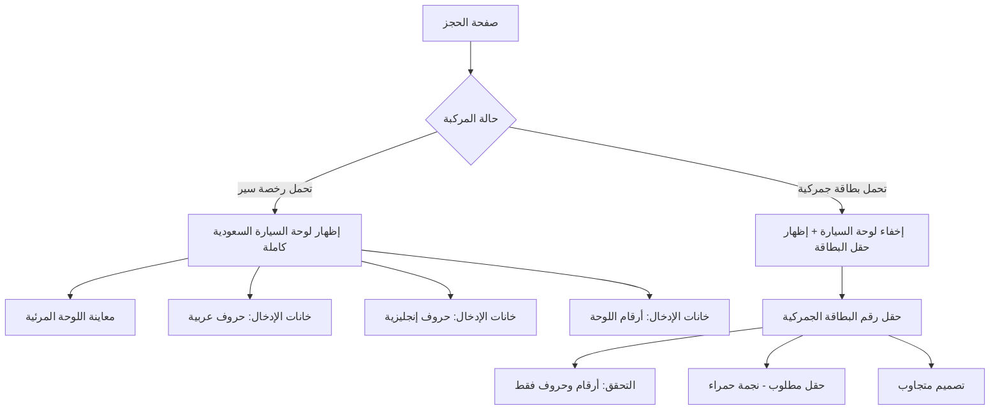

# خطة إضافة حقل رقم البطاقة الجمركية

## الملخص
تعديل صفحة الحجز [`Booking.tsx`](pages/client/Booking.tsx) لإظهار حقل "رقم البطاقة الجمركية" عند اختيار "تحمل بطاقة جمركية" مع إخفاء جميع عناصر لوحة السيارة السعودية.

## الوضع الحالي

### قسم حالة المركبة
يوجد تبويبان في السطر 1171-1189:
- **تحمل رخصة سير** (`license`) - الخيار الافتراضي
- **تحمل بطاقة جمركية** (`customs`)

### لوحة السيارة السعودية
تظهر في السطر 1195-1265 وتتضمن:
- معاينة اللوحة المرئية (شكل اللوحة)
- حقول الإدخال: حروف عربية، حروف إنجليزية، أرقام اللوحة

## التعديلات المطلوبة

### 1. إضافة حالة جديدة في formData
```typescript
customsCardNumber: ''  // رقم البطاقة الجمركية
```

### 2. تعديل واجهة المستخدم

عند اختيار `vehicleStatus === 'license'`:
- إظهار لوحة السيارة السعودية كاملة:
  - معاينة اللوحة المرئية
  - خانات الإدخال (حروف عربية، حروف إنجليزية، أرقام اللوحة)

عند اختيار `vehicleStatus === 'customs'`:
- **إخفاء جميع عناصر لوحة السيارة السعودية**:
  - إخفاء معاينة اللوحة المرئية
  - إخفاء خانات الإدخال (حروف عربية، حروف إنجليزية، أرقام اللوحة)
- **إظهار حقل "رقم البطاقة الجمركية"** مع:
  - نجمة حمراء (حقل مطلوب)
  - التحقق من الإدخال: أرقام وحروف فقط
  - تصميم متجاوب مع أحجام الشاشات

### 3. التنسيقات CSS المطلوبة

```css
/* حقل البطاقة الجمركية */
.bk-customs-card-input {
  /* تنسيقات مشابهة لباقي حقول الإدخال */
  height: 46px;
  border: 1px solid #cbd5e1;
  border-radius: 8px;
  padding: 0 14px;
  font-size: 15px;
  text-align: right;
  width: 100%;
  max-width: 400px;
}

/* تجاوب مع الشاشات الصغيرة */
@media (max-width: 768px) {
  .bk-customs-card-input {
    max-width: 100%;
  }
}
```

## مخطط التدفق



## التغييرات في الكود

### الملف: `pages/client/Booking.tsx`

#### 1. إضافة الحقل في formData (السطر ~70)
```typescript
customsCardNumber: '',
```

#### 2. تعديل قسم Plate (السطر 1191-1265)
استبدال قسم لوحة السيارة بمنطق شرطي - **عند اختيار البطاقة الجمركية يتم إخفاء جميع عناصر لوحة السيارة**:

```tsx
{formData.vehicleStatus === 'license' ? (
  // ═══════ رخصة السير: إظهار لوحة السيارة السعودية كاملة ═══════
  <>
    {/* Plate label */}
    <div className="bk-group" style={{ marginBottom: 8 }}>
      <label>{t('bookingPlateNumber')}<span className="required">*</span></label>
    </div>
    
    <div className="bk-plate-row">
      {/* Plate preview - شكل اللوحة المرئي */}
      <div className="bk-plate-preview">
        {/* ... كود معاينة اللوحة الحالي ... */}
      </div>

      {/* Plate inputs - خانات الإدخال */}
      <div className="bk-plate-inputs">
        {/* حروف عربية */}
        {/* حروف إنجليزية */}
        {/* أرقام اللوحة */}
      </div>
    </div>
  </>
) : (
  // ═══════ بطاقة جمركية: إخفاء اللوحة وإظهار حقل البطاقة ═══════
  <div className="bk-customs-card-wrapper">
    <div className="bk-group">
      <label>
        {isRTL ? 'رقم البطاقة الجمركية' : 'Customs Card Number'}
        <span className="required">*</span>
      </label>
      <input
        type="text"
        required
        placeholder={isRTL ? 'أدخل رقم البطاقة الجمركية' : 'Enter customs card number'}
        value={formData.customsCardNumber}
        onChange={e => {
          // السماح بالأرقام والحروف الإنجليزية فقط
          const val = e.target.value.replace(/[^a-zA-Z0-9]/g, '').toUpperCase();
          update('customsCardNumber', val);
        }}
        className="bk-customs-card-input"
        style={{ textAlign: 'center', letterSpacing: 2 }}
      />
    </div>
  </div>
)}
```

#### 3. إضافة التنسيقات CSS (داخل وسم style)
```css
/* Customs Card Input */
.bk-customs-card-wrapper {
  display: flex;
  justify-content: center;
  padding: 20px 0;
}

.bk-customs-card-wrapper .bk-group {
  max-width: 400px;
  width: 100%;
}

.bk-customs-card-input {
  font-family: monospace;
  font-weight: 600;
  letter-spacing: 2px;
}

/* Responsive */
@media (max-width: 480px) {
  .bk-customs-card-wrapper .bk-group {
    max-width: 100%;
  }
}
```

## ملاحظات إضافية

1. **التحقق من الإدخال**: استخدام regex `[^a-zA-Z0-9]` لمنع أي أحرف غير أبجدية رقمية
2. **التجاوب**: الخانة تأخذ عرض 100% على الشاشات الصغيرة
3. **التصميم**: متوافق مع تصميم الصفحة الحالي
4. **إمكانية الوصول**: إضافة `aria-label` مناسب للحقل الجديد

## الخطوات التنفيذية

1. [ ] إضافة `customsCardNumber` إلى formData
2. [ ] إضافة المنطق الشرطي لإظهار/إخفاء الحقول
3. [ ] إنشاء حقل إدخال رقم البطاقة الجمركية
4. [ ] إضافة التحقق من الإدخال
5. [ ] إضافة التنسيقات CSS
6. [ ] اختبار التجاوب على مختلف أحجام الشاشات
