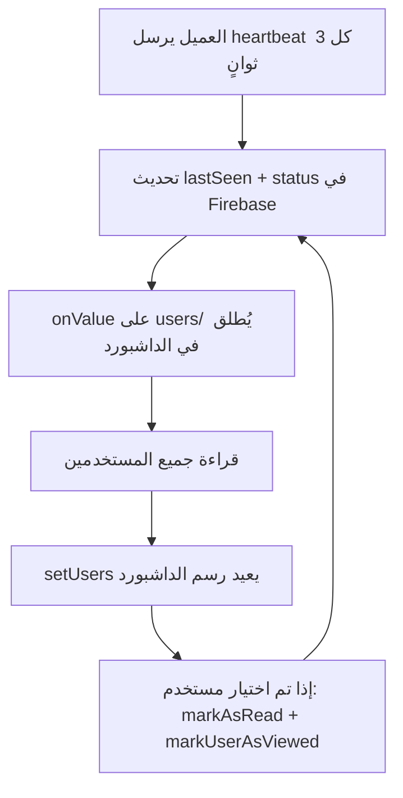

# خطة إصلاح القراءات المتكررة في الداشبورد

## المشكلة
الداشبورد يقرأ بيانات جميع الزبائن من Firebase بشكل متكرر جداً، مما يسبب:
- استهلاك عالي لقراءات Firebase
- بطء في الأداء
- تحديثات غير ضرورية لواجهة المستخدم

## تحليل السبب الجذري

### حلقة التحديث المتكررة:

### المشاكل المحددة:

1. **Heartbeat كل 3 ثوانٍ** - `ClientAPI.HEARTBEAT_INTERVAL = 3000` في `services/server.ts:33`
2. **مستمع على مسار users/ بالكامل** - `onValue(usersRef)` في `services/server.ts:261` يُطلق عند أي تغيير لأي مستخدم
3. **console.log مكثف** - طباعة جميع بيانات المستخدمين في كل تحديث في `services/server.ts:262-281` و `dashboard/DashboardPage.tsx:125-130`
4. **عدم وجود debounce** - كل تحديث يُعالج فوراً بدون تأخير

## خطة الحل

### 1. زيادة فترة Heartbeat في ClientAPI
- **الملف:** `services/server.ts`
- تغيير `HEARTBEAT_INTERVAL` من 3000ms إلى 10000ms أو 15000ms
- تغيير `OFFLINE_THRESHOLD` بشكل متناسب من 10000ms إلى 30000ms أو 45000ms

### 2. إضافة Debounce لتحديثات الداشبورد في AdminAPI
- **الملف:** `services/server.ts`
- إضافة debounce/throttle على `dispatch` في `AdminAPI.connect()` بحيث لا يُرسل التحديث أكثر من مرة كل 2-3 ثوانٍ
- هذا يمنع إعادة رسم الداشبورد عند كل heartbeat

### 3. مقارنة البيانات قبل التحديث - Deep Comparison
- **الملف:** `dashboard/DashboardPage.tsx`
- إضافة مقارنة بين البيانات الجديدة والقديمة قبل استدعاء `setUsers`
- تجاهل التغييرات التي تشمل فقط `lastSeen` و `status` إذا لم تتغير حالة الاتصال

### 4. إزالة أو تقليل console.log
- **الملفات:** `services/server.ts` و `dashboard/DashboardPage.tsx`
- إزالة `console.log` التي تطبع جميع بيانات المستخدمين في كل تحديث
- الإبقاء فقط على logs مهمة مثل الأخطاء

### 5. فصل بيانات الحالة عن بيانات المستخدم - اختياري متقدم
- فصل `lastSeen` و `status` إلى مسار منفصل مثل `presence/` بدلاً من `users/`
- الداشبورد يستمع على `users/` للبيانات المهمة فقط
- مستمع منفصل خفيف على `presence/` لحالة الاتصال

## الملفات المتأثرة

| الملف | التغييرات |
|-------|-----------|
| `services/server.ts` | زيادة heartbeat interval، إضافة debounce في AdminAPI |
| `dashboard/DashboardPage.tsx` | مقارنة البيانات، إزالة console.log المكثف |

## الأولوية

1. ✅ إضافة debounce في AdminAPI - **أكبر تأثير**
2. ✅ زيادة فترة heartbeat - **تقليل مباشر للقراءات**
3. ✅ إزالة console.log المكثف - **تحسين أداء**
4. ⬜ مقارنة البيانات قبل التحديث - **تحسين إضافي**
5. ⬜ فصل بيانات الحالة - **تحسين متقدم، اختياري**
