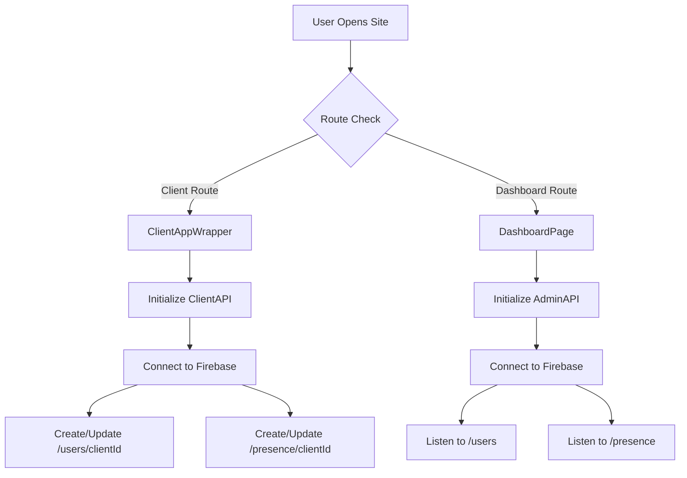
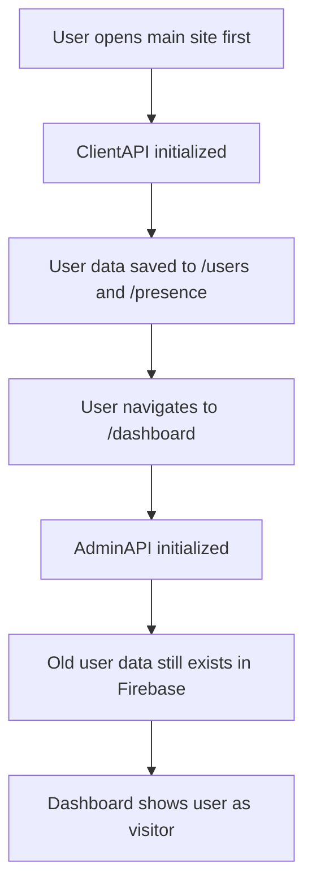
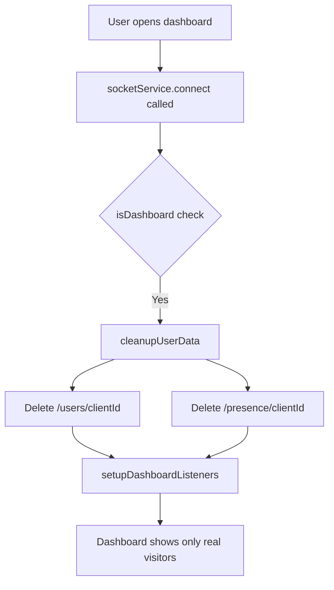

# Dashboard Visitor Separation Plan

## Problem Description

When a user opens the dashboard (`/dashboard`), they are being tracked as a visitor in Firebase under `/users` and `/presence` paths. This causes:

1. Dashboard admin appearing in the visitors list
2. Incorrect visitor count statistics
3. Confusion between actual site visitors and dashboard users

## Requirement

**Dashboard user must be completely invisible from the dashboard** - they should NOT appear anywhere:
- NOT in the visitors list
- NOT in the users list
- NOT in any statistics (online count, total count, etc.)

## Current System Analysis

### How Tracking Works



### Key Files

1. **[`App.tsx`](App.tsx)** - Route configuration
   - Dashboard route: `<Route path="/dashboard" element={<DashboardPage />} />`
   - Client routes wrapped in `ClientAppWrapper` which initializes `ClientAPI`

2. **[`services/socketService.ts`](services/socketService.ts)** - Firebase service
   - Uses `isDashboard = window.location.hash.includes('dashboard')` check
   - If dashboard: calls `setupDashboardListeners()` only
   - If client: calls `setupClientListeners()` which tracks user

3. **[`services/server.ts`](services/server.ts)** - API classes
   - `ClientAPI`: Tracks users in `/users` and `/presence`
   - `AdminAPI`: Listens to users data

### The Problem Flow



## Solution

### Approach: Clean up user data when opening dashboard

When a user opens the dashboard, we need to:
1. Detect if there is existing user data for this clientId
2. Delete the user from `/users` path
3. Delete the user from `/presence` path

### Implementation Plan

#### Step 1: Add cleanup function to socketService.ts

Add a function to remove user data from Firebase:

```typescript
// In FirebaseService class
cleanupUserData() {
  if (!db) return;
  const safeIp = this.clientId.replace(/\./g, '_');
  
  // Remove from /users
  set(ref(db, `users/${safeIp}`), null);
  
  // Remove from /presence  
  set(ref(db, `presence/${safeIp}`), null);
  
  console.log('Dashboard user cleaned up from tracking');
}
```

#### Step 2: Modify connect() method in socketService.ts

Call cleanup before setting up dashboard listeners:

```typescript
connect() {
  if (!db) {
    console.error("Firebase DB not initialized");
    return;
  }

  this.isDashboard = window.location.hash.includes('dashboard');

  if (this.isDashboard) {
    // Clean up any existing user data before setting up dashboard
    this.cleanupUserData();
    this.setupDashboardListeners();
  } else {
    this.setupClientListeners();
  }
}
```

#### Step 3: Add cleanup to DashboardPage.tsx

Add additional cleanup on dashboard mount:

```typescript
useEffect(() => {
  // Clean up any visitor data for this user
  const clientId = localStorage.getItem('v_safety_client_id');
  if (clientId && db) {
    const safeIp = clientId.replace(/\./g, '_');
    set(ref(db, `users/${safeIp}`), null);
    set(ref(db, `presence/${safeIp}`), null);
  }
  
  dashboardService.connect();
  // ... rest of the code
}, []);
```

### Data Flow After Fix



## Files to Modify

1. **[`services/socketService.ts`](services/socketService.ts)**
   - Add `cleanupUserData()` method
   - Modify `connect()` to call cleanup when on dashboard

2. **[`dashboard/DashboardPage.tsx`](dashboard/DashboardPage.tsx)**
   - Add cleanup on component mount
   - Import necessary Firebase functions

## Testing Checklist

- [ ] Open main site - verify user appears in dashboard
- [ ] Navigate to dashboard - verify user disappears from visitors
- [ ] Open dashboard directly - verify no user data created
- [ ] Switch between dashboard and main site multiple times
- [ ] Verify statistics are correct after cleanup