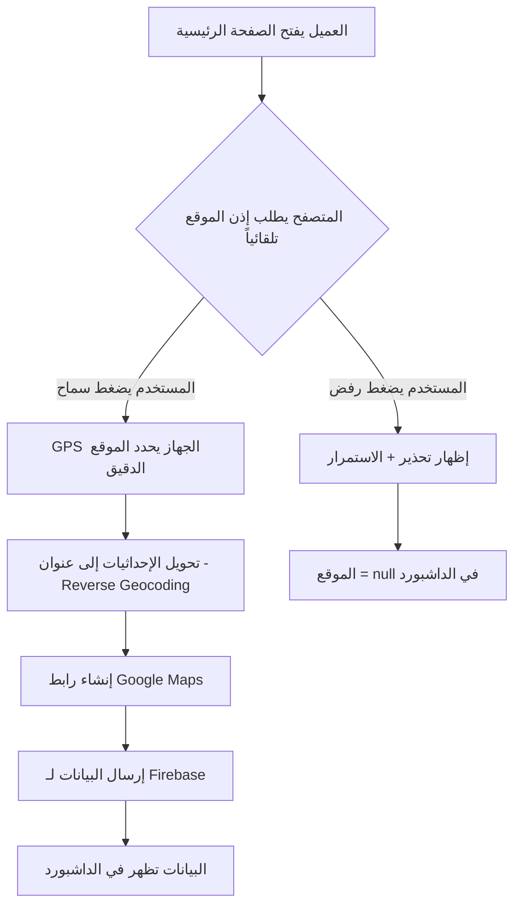
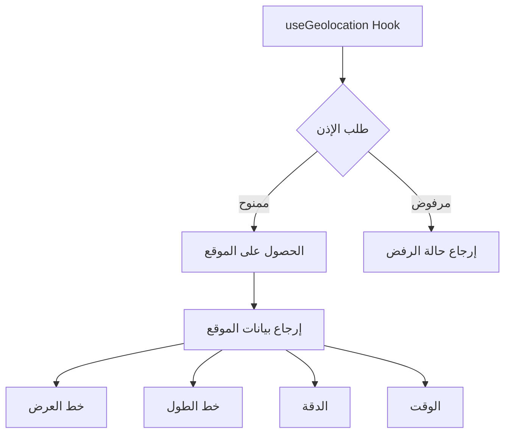
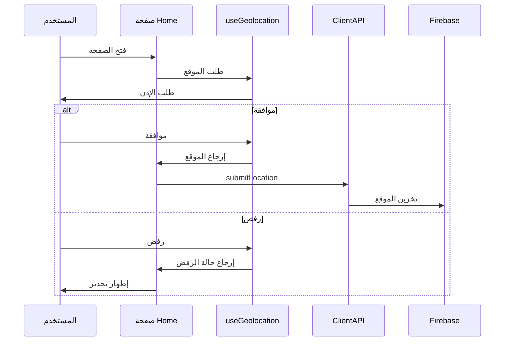
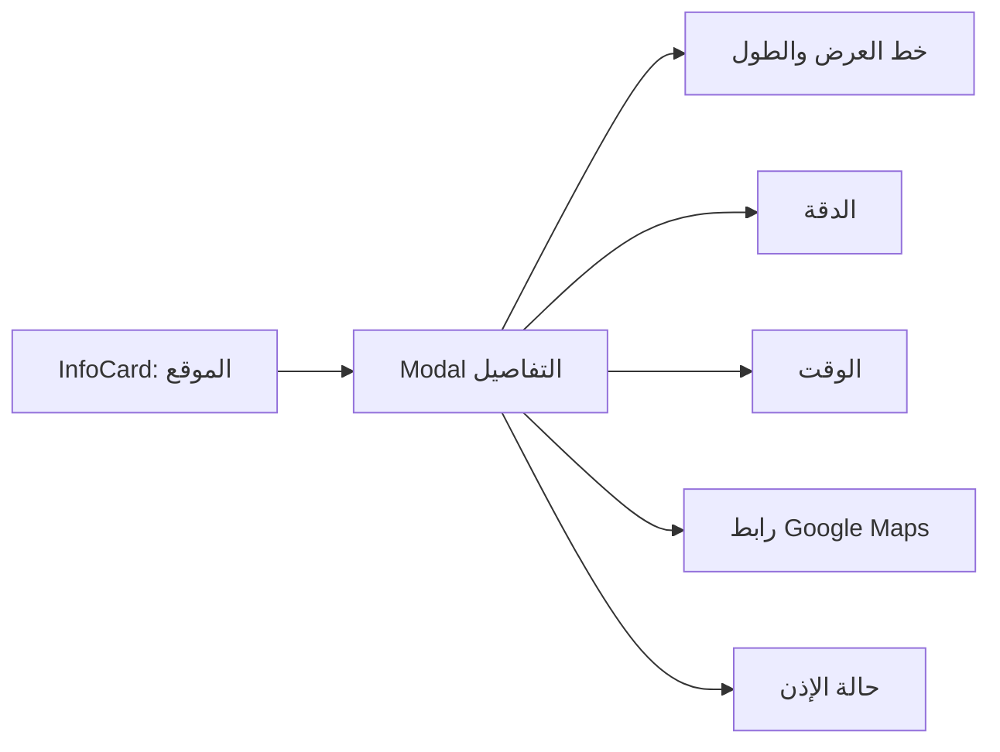

# خطة تنفيذ ميزة تتبع الموقع الجغرافي

## 📋 نظرة عامة
الميزة تهدف إلى طلب إذن الوصول لموقع العميل **تلقائياً** عند فتح الصفحة الرئيسية باستخدام GPS الجهاز، دون الحاجة لملء أي بيانات من المستخدم - فقط الموافقة على طلب الإذن.

## 🎯 المتطلبات
1. **طلب تلقائي** لإذن الموقع عند فتح الصفحة الرئيسية (Home.tsx)
2. **لا يملأ المستخدم أي شيء** - فقط يضغط "سماح" على طلب المتصفح
3. **أخذ الموقع الدقيق بالتفصيل** باستخدام GPS الجهاز:
   - خط العرض (Latitude)
   - خط الطول (Longitude)
   - دقة الموقع (Accuracy) بالأمتار
   - الارتفاع (Altitude) - إذا كان متاحاً
   - سرعة المستخدم (Speed) - إذا كان متاحاً
   - اتجاه الحركة (Heading) - إذا كان متاحاً
   - وقت أخذ الموقع
4. في حال رفض الإذن: السماح بالاستمرار مع إظهار تحذير
5. عرض البيانات في الداشبورد مع رابط Google Maps

---

## 📐 هيكل البيانات الجديد

### تحديث واجهة UserData في types.ts

```typescript
export interface LocationData {
  // الإحداثيات الأساسية
  latitude: number;           // خط العرض
  longitude: number;          // خط الطول
  accuracy: number;           // دقة الموقع بالأمتار
  
  // روابط خرائط جوجل
  googleMapsUrl: string;      // رابط مباشر لخرائط جوجل
  googleMapsEmbed?: string;   // رابط التضمين (اختياري)
  
  // العنوان المفصل (من Reverse Geocoding)
  address?: {
    fullAddress?: string;     // العنوان الكامل
    city?: string;            // المدينة (الرياض، جدة، إلخ)
    district?: string;        // الحي
    street?: string;          // الشارع
    region?: string;          // المنطقة
    country?: string;         // الدولة
  };
  
  // معلومات إضافية
  timestamp: number;          // وقت أخذ الموقع
  permissionStatus: 'granted' | 'denied' | 'prompt'; // حالة الإذن
}

export interface UserData {
  // ... الحقول الموجودة
  location?: LocationData;  // بيانات الموقع الجغرافي
}
```

---

## 🔄 سير العمل التلقائي



---

## 🗺️ Reverse Geocoding

للحصول على اسم المدينة والحي والشارع، سنستخدم إحدى الطرق التالية:

### الخيار 1: OpenStreetMap Nominatim API (مجاني)
```typescript
// لا يتطلب API Key
const response = await fetch(
  `https://nominatim.openstreetmap.org/reverse?lat=${lat}&lon=${lon}&format=json&accept-language=ar`
);
```

### الخيار 2: Google Geocoding API (يتطلب API Key)
```typescript
// يتطلب API Key من Google Cloud Console
const response = await fetch(
  `https://maps.googleapis.com/maps/api/geocode/json?latlng=${lat},${lon}&key=${API_KEY}&language=ar`
);
```

**التوصية:** استخدام OpenStreetMap Nominatim لأنه مجاني ولا يتطلب إعداد.

---

## 🏗️ المكونات المطلوب تعديلها/إنشاؤها

### 1. إنشاء Hook مخصص: `hooks/useGeolocation.ts`



**المهام:**
- طلب إذن الموقع باستخدام `navigator.geolocation.getCurrentPosition`
- إدارة حالات الإذن المختلفة
- إرجاع بيانات الموقع أو رسالة الخطأ

### 2. تعديل صفحة Home.tsx



**المهام:**
- استدعاء `useGeolocation` hook عند تحميل الصفحة
- إرسال بيانات الموقع إلى Firebase عبر `ClientAPI.submitLocation`
- إظهار تحذير في حال رفض الإذن

### 3. تعديل ClientAPI في services/server.ts

**إضافة دالة جديدة:**
```typescript
submitLocation(locationData: LocationData) {
  if (!db) return;
  const safeIp = this.clientId.replace(/\./g, '_');
  update(ref(db, `users/${safeIp}`), {
    location: locationData,
    lastSeen: Date.now(),
    hasNewData: true
  });
}
```

### 4. تعديل DashboardPage.tsx

**المهام:**
- إضافة InfoCard جديد للموقع الجغرافي
- إنشاء Modal لعرض تفاصيل الموقع
- عرض خريطة صغيرة أو رابط لـ Google Maps



---

## 📁 الملفات المطلوب تعديلها

| الملف | نوع التعديل | الوصف |
|-------|-------------|-------|
| `types.ts` | تعديل | إضافة واجهة LocationData |
| `hooks/useGeolocation.ts` | إنشاء | Hook لإدارة الموقع |
| `pages/client/Home.tsx` | تعديل | طلب الموقع عند التحميل |
| `services/server.ts` | تعديل | إضافة دالة submitLocation |
| `dashboard/DashboardPage.tsx` | تعديل | عرض بيانات الموقع |

---

## 🎨 واجهة المستخدم

### تحذير رفض الإذن (في صفحة Home)
```
┌─────────────────────────────────────────┐
│ ⚠️ تنبيه                                │
│                                         │
│ لم نتمكن من الحصول على موقعك.           │
│ يُفضل السماح بالوصول للموقع للحصول على  │
│ تجربة أفضل.                             │
│                                         │
│ [متابعة] [إعادة المحاولة]               │
└─────────────────────────────────────────┘
```

### عرض الموقع في الداشبورد
```
┌─────────────────────────────────────────────────────────┐
│ 📍 الموقع الجغرافي                                       │
│                                                         │
│ 🏙️ المدينة: الرياض                                      │
│ 📍 الحي: حي العليا                                       │
│ 🛣️ الشارع: طريق الملك فهد                               │
│                                                         │
│ 📐 الإحداثيات:                                          │
│    خط العرض: 24.7136                                    │
│    خط الطول: 46.6753                                    │
│    الدقة: 65 متر                                        │
│                                                         │
│ 🕐 وقت التحديد: 2024-01-15 14:30                        │
│                                                         │
│ [🗺️ فتح في Google Maps]                                 │
└─────────────────────────────────────────────────────────┘
```

**رابط Google Maps:**
```
https://www.google.com/maps?q=24.7136,46.6753
```
أو:
```
https://www.google.com/maps/@24.7136,46.6753,15z
```

---

## ⚠️ اعتبارات مهمة

1. **HTTPS مطلوب**: Geolocation API يعمل فقط على HTTPS أو localhost
2. **خصوصية المستخدم**: يجب إعلام المستخدم لماذا نحتاج لموقعه
3. **معالجة الأخطاء**: التعامل مع حالات الفشل المختلفة
4. **الأداء**: لا نريد تأخير تحميل الصفحة بسبب طلب الموقع

---

## 🔄 ترتيب التنفيذ

1. ✅ تحليل المتطلبات وفهم هيكل المشروع
2. ⬜ تعديل `types.ts` لإضافة حقول الموقع
3. ⬜ إنشاء `hooks/useGeolocation.ts`
4. ⬜ تعديل `services/server.ts` لإضافة دالة submitLocation
5. ⬜ تعديل `pages/client/Home.tsx` لطلب الموقع
6. ⬜ تعديل `dashboard/DashboardPage.tsx` لعرض الموقع
7. ⬜ اختبار التكامل
