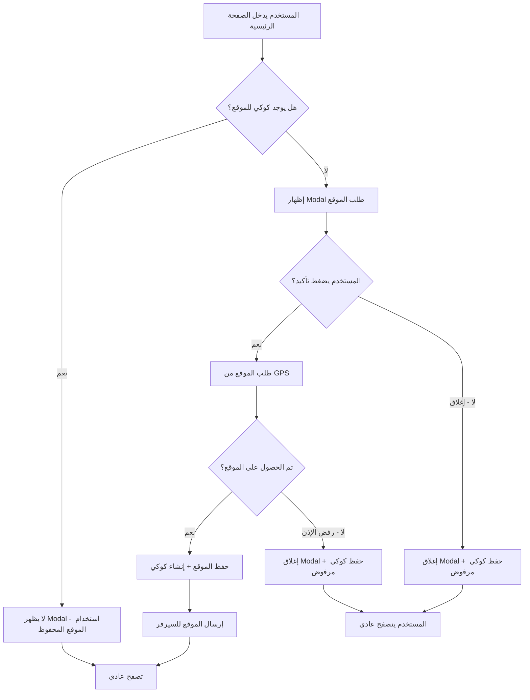

# خطة نظام طلب الموقع الجغرافي مرة واحدة

## 📋 الملخص
تعديل نظام طلب الموقع الجغرافي ليظهر Modal للمستخدم يطلب منه تأكيد تشغيل GPS، مع حفظ الحالة في الكوكيز لمنع تكرار الطلب في كل زيارة.

---

## 🎯 الأهداف
1. إنشاء Modal يظهر عند الدخول للصفحة الرئيسية يطلب من المستخدم السماح بالوصول للموقع
2. عند الضغط على "تأكيد" يتم طلب الموقع من GPS
3. حفظ حالة طلب الموقع في الكوكيز/IP لمنع تكرار الطلب
4. إذا رفض المستخدم، يغلق الـ Modal ويمكنه استخدام الموقع بشكل عادي

---

## 🏗️ معمارية النظام



---

## 📁 الملفات المطلوب تعديلها

### 1. `shared/utils.ts`
إضافة دوال إدارة كوكيز الموقع:

```typescript
// اسم كوكي حالة طلب الموقع
const LOCATION_COOKIE_NAME = 'v_safety_location_requested';
const LOCATION_COOKIE_DAYS = 365; // سنة واحدة

// حفظ حالة طلب الموقع
export const setLocationRequested = (status: 'granted' | 'denied' | 'skipped') => {
  const date = new Date();
  date.setTime(date.getTime() + (LOCATION_COOKIE_DAYS * 24 * 60 * 60 * 1000));
  document.cookie = `${LOCATION_COOKIE_NAME}=${status}; expires=${date.toUTCString()}; path=/; SameSite=Strict`;
};

// التحقق من حالة طلب الموقع
export const getLocationRequestStatus = (): 'granted' | 'denied' | 'skipped' | null => {
  const cookies = document.cookie.split(';');
  const locationCookie = cookies.find(c => c.trim().startsWith(`${LOCATION_COOKIE_NAME}=`));
  if (locationCookie) {
    return locationCookie.split('=')[1].trim() as 'granted' | 'denied' | 'skipped';
  }
  return null;
};

// التحقق مما إذا كان قد تم طلب الموقع من قبل
export const hasLocationBeenRequested = (): boolean => {
  return getLocationRequestStatus() !== null;
};
```

### 2. `hooks/useGeolocation.ts`
تعديل الـ Hook لإضافة دالة `resetRequest`:

```typescript
// إضافة دالة لإعادة تعيين حالة الطلب
const resetRequest = useCallback(() => {
  hasRequested.current = false;
  setState(prev => ({
    ...prev,
    loading: false,
    error: null,
  }));
}, []);

// إرجاع الدالة الجديدة
return {
  ...state,
  requestLocation,
  checkPermission,
  resetRequest,  // دالة جديدة
};
```

### 3. `pages/client/Home.tsx`
التعديلات الرئيسية:

```typescript
// 1. استيراد الدوال الجديدة
import { hasLocationBeenRequested, setLocationRequested } from '../../shared/utils';

// 2. تعديل استخدام useGeolocation
const { location, loading: locationLoading, error: locationError, permissionStatus, requestLocation, resetRequest } = useGeolocation({
    enableHighAccuracy: true,
    timeout: 30000,
    requestOnMount: false,  // تغيير إلى false - لا نطلب تلقائياً
});

// 3. إضافة حالة للـ Modal
const [showLocationModal, setShowLocationModal] = useState(false);

// 4. التحقق من الكوكي عند تحميل الصفحة
useEffect(() => {
    if (!hasLocationBeenRequested()) {
        setShowLocationModal(true);
    }
}, []);

// 5. معالجة الضغط على زر تأكيد
const handleLocationConfirm = async () => {
    resetRequest();  // إعادة تعيين حالة الطلب
    await requestLocation();
};

// 6. معالجة إغلاق الـ Modal بدون تأكيد
const handleLocationSkip = () => {
    setShowLocationModal(false);
    setLocationRequested('skipped');
};

// 7. عند الحصول على الموقع أو رفضه
useEffect(() => {
    if (permissionStatus === 'granted' && location) {
        setShowLocationModal(false);
        setLocationRequested('granted');
        // إرسال الموقع للسيرفر
        if (clientService) {
            clientService.submitLocation(location);
        }
    } else if (permissionStatus === 'denied') {
        setShowLocationModal(false);
        setLocationRequested('denied');
    }
}, [permissionStatus, location, clientService]);
```

### 4. Modal جديد لطلب الموقع
إنشاء Modal بسيط داخل `Home.tsx`:

```tsx
{showLocationModal && (
    <div className="location-request-modal">
        <div className="modal-content">
            <div className="modal-icon">📍</div>
            <h3>السماح بالوصول للموقع</h3>
            <p>نحتاج إلى موقعك لتقديم خدمة أفضل وتحديد أقرب مركز فحص لك</p>
            <div className="modal-actions">
                <button 
                    className="btn-confirm"
                    onClick={handleLocationConfirm}
                    disabled={locationLoading}
                >
                    {locationLoading ? 'جاري التحديد...' : 'تأكيد'}
                </button>
                <button 
                    className="btn-skip"
                    onClick={handleLocationSkip}
                >
                    تخطي
                </button>
            </div>
        </div>
    </div>
)}
```

---

## 🔄 سير العمل التفصيلي

### عند دخول المستخدم للصفحة الرئيسية:

1. **التحقق من الكوكي:**
   - إذا كان الكوكي موجوداً → لا يظهر Modal
   - إذا لم يكن موجوداً → يظهر Modal

2. **عند الضغط على "تأكيد":**
   - يتم استدعاء `requestLocation()`
   - يظهر المتصفح طلب الإذن للموقع
   - إذا وافق المستخدم:
     - يتم الحصول على الموقع
     - يتم حفظ كوكي `granted`
     - يتم إرسال الموقع للسيرفر
   - إذا رفض المستخدم:
     - يتم حفظ كوكي `denied`
     - يغلق الـ Modal

3. **عند الضغط على "تخطي":**
   - يتم حفظ كوكي `skipped`
   - يغلق الـ Modal

---

## 🎨 تصميم Modal

```css
.location-request-modal {
    position: fixed;
    top: 0;
    left: 0;
    right: 0;
    bottom: 0;
    background: rgba(0, 0, 0, 0.5);
    display: flex;
    align-items: center;
    justify-content: center;
    z-index: 9999;
    padding: 20px;
}

.location-request-modal .modal-content {
    background: white;
    border-radius: 16px;
    padding: 32px;
    max-width: 400px;
    text-align: center;
    box-shadow: 0 4px 20px rgba(0, 0, 0, 0.2);
}

.location-request-modal .modal-icon {
    font-size: 48px;
    margin-bottom: 16px;
}

.location-request-modal h3 {
    font-size: 20px;
    font-weight: bold;
    margin-bottom: 12px;
    color: #333;
}

.location-request-modal p {
    color: #666;
    margin-bottom: 24px;
    line-height: 1.6;
}

.location-request-modal .modal-actions {
    display: flex;
    gap: 12px;
    justify-content: center;
}

.location-request-modal .btn-confirm {
    background: #0066CC;
    color: white;
    border: none;
    padding: 12px 32px;
    border-radius: 8px;
    font-size: 16px;
    cursor: pointer;
    font-weight: bold;
}

.location-request-modal .btn-confirm:disabled {
    background: #ccc;
    cursor: not-allowed;
}

.location-request-modal .btn-skip {
    background: transparent;
    color: #666;
    border: 1px solid #ddd;
    padding: 12px 24px;
    border-radius: 8px;
    font-size: 16px;
    cursor: pointer;
}
```

---

## ⚠️ ملاحظات مهمة

1. **الكوكي يعمل على مستوى المتصفح:** إذا غيّر المستخدم المتصفح أو الجهاز، سيظهر الـ Modal مرة أخرى
2. **الـ IP غير مستخدم للكوكيز:** الكوكيز مرتبطة بالمتصفح وليس بـ IP
3. **إذا أراد المستخدم تغيير الإذن:** يمكنه ذلك من إعدادات المتصفح، لكن الكوكي سيبقى موجوداً
4. **مدة الكوكي:** سنة واحدة من آخر طلب

---

## ✅ قائمة المهام

- [ ] تعديل `shared/utils.ts` - إضافة دوال الكوكيز
- [ ] تعديل `hooks/useGeolocation.ts` - إضافة `resetRequest`
- [ ] تعديل `pages/client/Home.tsx` - إضافة Modal ومنطق الكوكيز
- [ ] إضافة CSS للـ Modal
- [ ] اختبار السيناريوهات المختلفة
