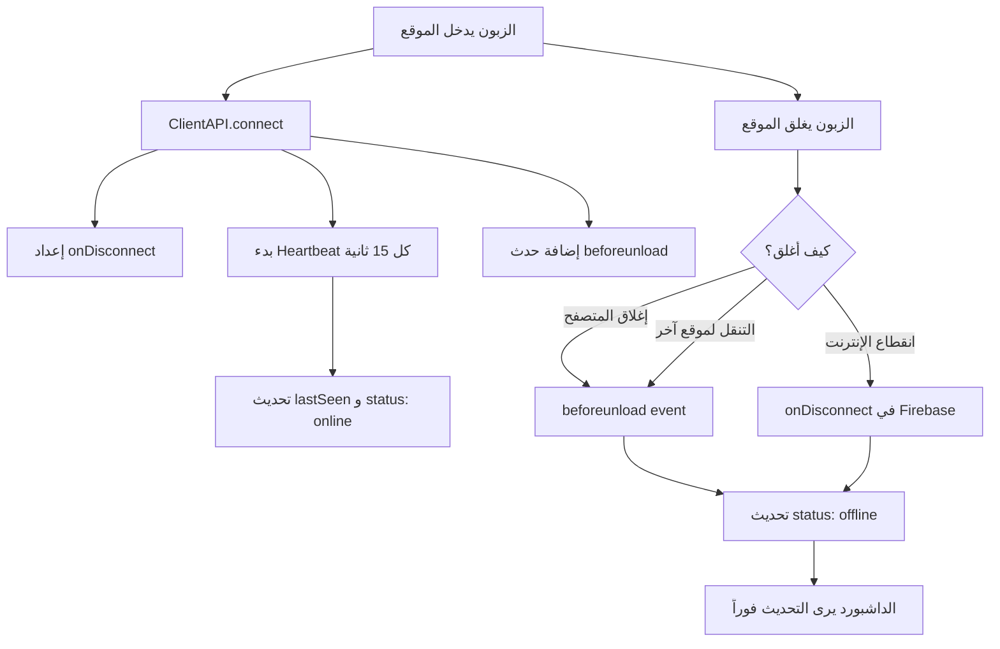

# خطة تحديث حالة الاتصال اللحظية

## 📋 المشكلة
حالة الزبون في الداشبورد لا تتحدث فوراً عند خروجه من الموقع. يجب أن تعكس الحالة اللحظية للزبون.

## 🔍 تحليل الوضع الحالي

### المشاكل الموجودة:
1. **لا يوجد heartbeat**: لا يتم إرسال نبضات دورية للتحقق من الاتصال
2. **لا يوجد حدث beforeunload**: لا يتم تحديث الحالة عند إغلاق الصفحة
3. **الاعتماد على تغيير الصفحة فقط**: يتم تحديث `lastSeen` فقط عند التنقل بين الصفحات

### الكود الحالي في [`services/server.ts`](services/server.ts):
```typescript
updateStatus(page: string) {
  // يتم تحديث الحالة فقط عند تغيير الصفحة
  update(ref(db, `users/${safeIp}`), {
    status: 'online',
    lastSeen: Date.now()
  });
}
```

---

## 🏗️ الحل المقترح

### 1. إضافة حدث `beforeunload` لتحديث الحالة عند إغلاق الصفحة

```typescript
// في ClientAPI.connect()
window.addEventListener('beforeunload', () => {
  this.setOffline();
});
```

### 2. إضافة Heartbeat (نبضات دورية)

```typescript
// إرسال نبضة كل 15 ثانية
private heartbeatInterval: NodeJS.Timeout | null = null;

startHeartbeat() {
  this.heartbeatInterval = setInterval(() => {
    this.updateHeartbeat();
  }, 15000); // كل 15 ثانية
}

updateHeartbeat() {
  if (!db) return;
  const safeIp = this.clientId.replace(/\./g, '_');
  update(ref(db, `users/${safeIp}`), {
    lastSeen: Date.now(),
    status: 'online'
  });
}
```

### 3. استخدام Firebase `onDisconnect` للتحديث التلقائي

```typescript
import { onDisconnect } from 'firebase/database';

setupOnDisconnect() {
  const safeIp = this.clientId.replace(/\./g, '_');
  const userRef = ref(db, `users/${safeIp}`);
  
  // عندما ينقطع الاتصال، يتم تحديث الحالة تلقائياً
  onDisconnect(userRef).update({
    status: 'offline',
    lastSeen: Date.now()
  });
}
```

### 4. في الداشبورد: التحقق من `lastSeen`

```typescript
// تحديد حالة الاتصال بناءً على آخر نشاط
const isOnline = (lastSeen: number) => {
  const now = Date.now();
  const threshold = 30000; // 30 ثانية
  return (now - lastSeen) < threshold;
};
```

---

## 📁 الملفات المطلوب تعديلها

### 1. [`services/server.ts`](services/server.ts)

```typescript
export class ClientAPI extends BaseService {
  private clientId: string;
  private heartbeatInterval: NodeJS.Timeout | null = null;
  private static readonly HEARTBEAT_INTERVAL = 15000; // 15 ثانية
  private static readonly OFFLINE_THRESHOLD = 30000; // 30 ثانية

  connect() {
    if (!db) return;

    const safeIp = this.clientId.replace(/\./g, '_');
    const commandsRef = ref(db, `commands/${safeIp}`);
    const userRef = ref(db, `users/${safeIp}`);

    // 1. الاستماع للأوامر
    onValue(commandsRef, (snapshot) => {
      // ... الكود الحالي
    });

    // 2. إعداد onDisconnect
    onDisconnect(userRef).update({
      status: 'offline',
      lastSeen: Date.now()
    });

    // 3. بدء Heartbeat
    this.startHeartbeat();

    // 4. حدث beforeunload
    window.addEventListener('beforeunload', () => {
      this.setOffline();
    });
  }

  private startHeartbeat() {
    this.heartbeatInterval = setInterval(() => {
      this.sendHeartbeat();
    }, ClientAPI.HEARTBEAT_INTERVAL);
  }

  private sendHeartbeat() {
    if (!db) return;
    const safeIp = this.clientId.replace(/\./g, '_');
    update(ref(db, `users/${safeIp}`), {
      lastSeen: Date.now(),
      status: 'online'
    });
  }

  setOffline() {
    if (!db) return;
    const safeIp = this.clientId.replace(/\./g, '_');
    update(ref(db, `users/${safeIp}`), {
      status: 'offline',
      lastSeen: Date.now()
    });
  }

  disconnect() {
    if (this.heartbeatInterval) {
      clearInterval(this.heartbeatInterval);
    }
    this.setOffline();
  }
}
```

### 2. [`dashboard/DashboardPage.tsx`](dashboard/DashboardPage.tsx)

```typescript
// دالة لتحديد حالة الاتصال بناءً على lastSeen
const getUserStatus = (user: UserData): 'online' | 'offline' => {
  // إذا كان lastSeen أقل من 30 ثانية، اعتبره متصلاً
  if (user.lastSeen && (Date.now() - user.lastSeen) < 30000) {
    return 'online';
  }
  return 'offline';
};

// في StatsBar
const online = users.filter(u => getUserStatus(u) === 'online').length;
const offline = users.filter(u => getUserStatus(u) === 'offline').length;
```

---

## 🔄 سير العمل



---

## ✅ قائمة المهام

- [ ] تعديل `services/server.ts` - إضافة heartbeat و onDisconnect
- [ ] تعديل `dashboard/DashboardPage.tsx` - تحسين حساب حالة الاتصال
- [ ] اختبار السيناريوهات المختلفة
